# Proyecto Integrador – Avance 2  
## Ingesta de Datos en Zona RAW

Este proyecto implementa un pipeline de ingesta de datos climáticos utilizando **OpenWeather API**, **Airbyte** y **Amazon S3**, siguiendo una arquitectura de **Data Lake**.

El objetivo de este avance es cargar datos externos en la **zona RAW del Data Lake** y generar una capa de **históricos** que permita almacenar las mediciones a lo largo del tiempo.

---

# Arquitectura del flujo de datos

El pipeline implementado sigue el siguiente flujo:

OpenWeather API  
↓  
Airbyte  
↓  
Amazon S3 (raw/ingesta-tiempo-real)  
↓  
Script Python  
↓  
Amazon S3 (raw/historicos)

La carpeta `ingesta-tiempo-real` contiene el estado más reciente de los datos, mientras que `historicos` mantiene un registro acumulado de todas las mediciones.

---

# 1. Creación del bucket en Amazon S3

Se crea el bucket que funcionará como **Data Lake**.

datalake-energy-dev-marianagil
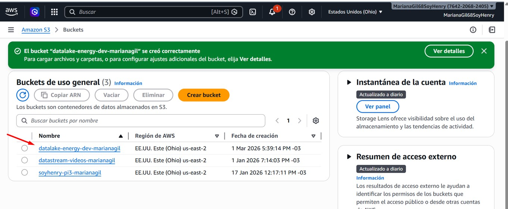
Dentro del bucket se crea la carpeta:

raw/
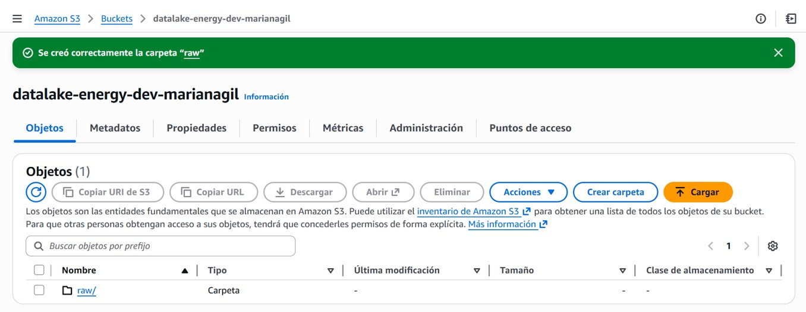
Esta carpeta almacena los datos en su formato original.

---

# 2. Creación de la política de acceso

Se crea una política IAM que permite a Airbyte escribir en la zona RAW del Data Lake.

```json
{
  "Version": "2012-10-17",
  "Statement": [
    {
      "Sid": "AllowAirbyteToWriteRawLayer",
      "Effect": "Allow",
      "Action": [
        "s3:PutObject",
        "s3:DeleteObject",
        "s3:ListBucket",
        "s3:GetBucketLocation"
      ],
      "Resource": [
        "arn:aws:s3:::datalake-energy-dev-marianagil",
        "arn:aws:s3:::datalake-energy-dev-marianagil/raw/*"
      ]
    }
  ]
}
```

---

# 3. Creación del usuario IAM

Se crea un usuario IAM que utiliza la política anterior.
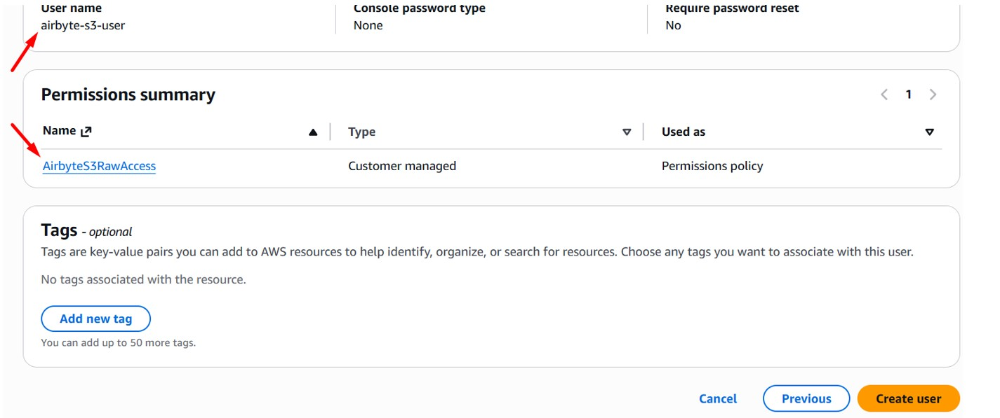
Luego se generan las credenciales de acceso:
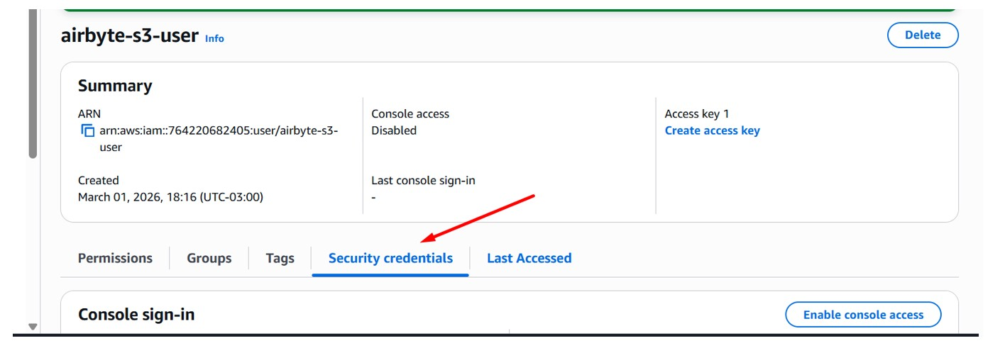
- Access Key  
- Secret Access Key  
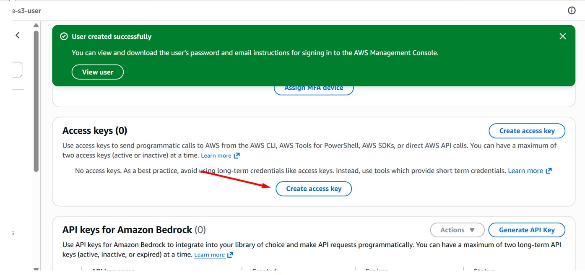
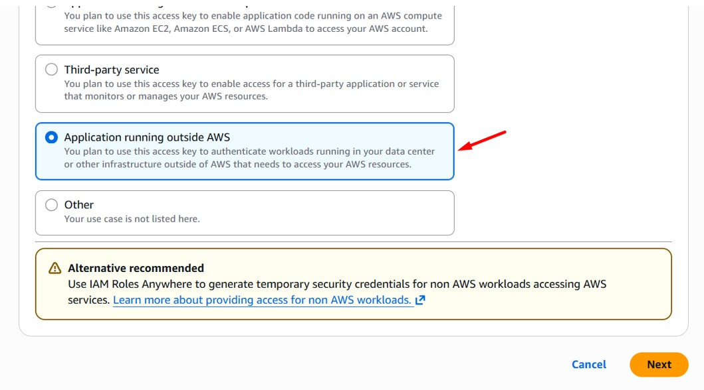
Estas credenciales se utilizan posteriormente para configurar el destino en Airbyte.

---

# 4. Configuración de Airbyte

Se accede a **Airbyte Cloud** utilizando autenticación con GitHub.
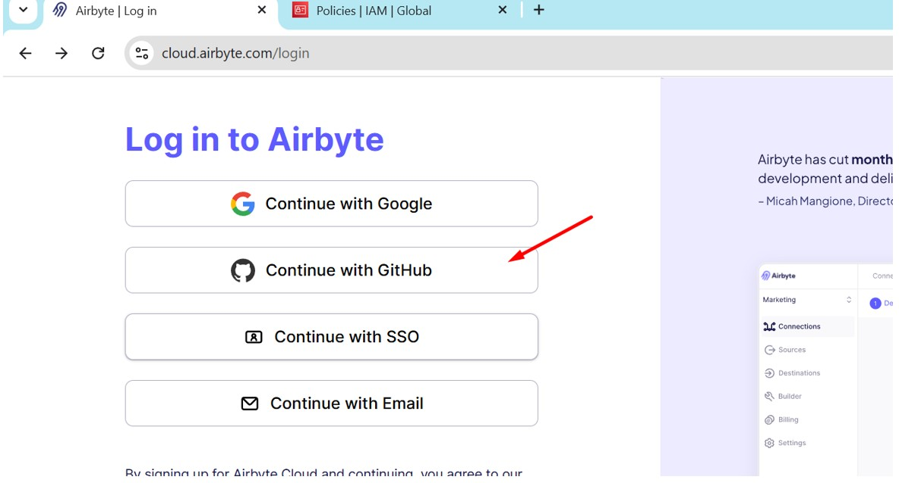
Luego se crea un nuevo **Destination** de tipo:

Amazon S3
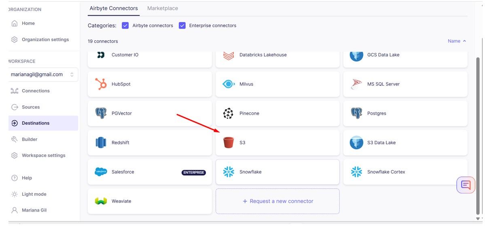
Configurando:

- Bucket
- Región
- Access Key
- Secret Key
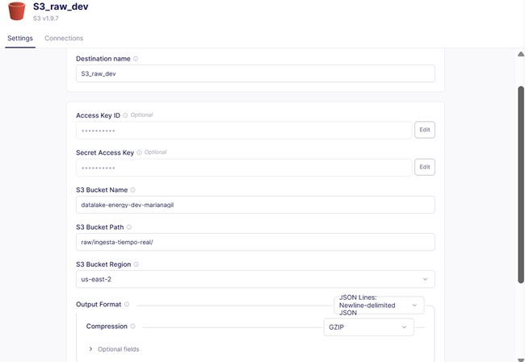
Este destino corresponde a la carpeta:

raw/ingesta-tiempo-real

---

# 5. Creación de la fuente de datos

Se crea una fuente utilizando la **API de OpenWeather**.
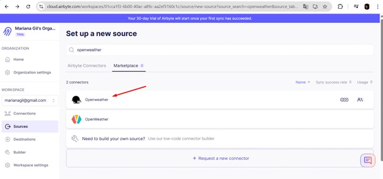
Para ello se obtiene una API Key desde:

https://home.openweathermap.org/api_keys
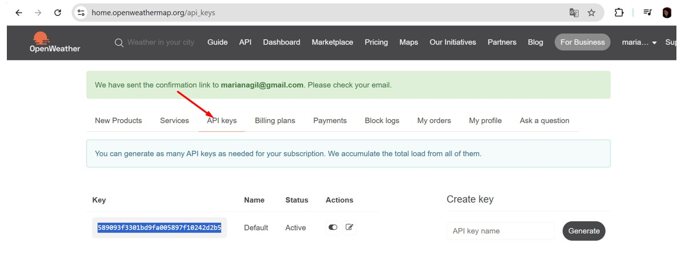
Luego se configuran dos streams utilizando latitud y longitud:

- weather_patagonia
- weather_riohacha

Los parámetros utilizados en la API son:

- lat
- lon
- appid
- units=metric
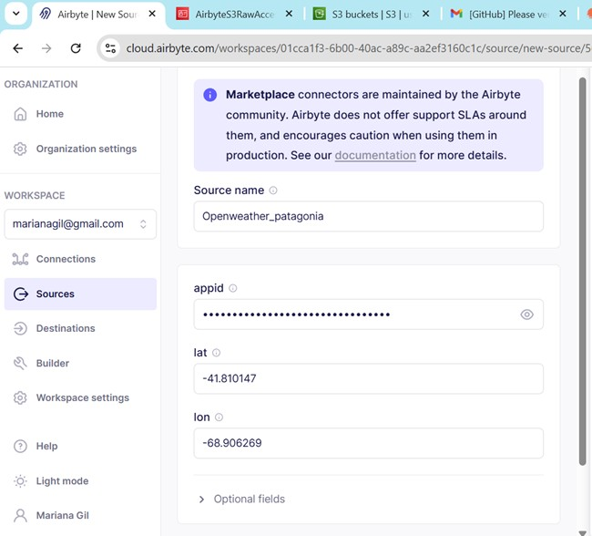
Cada stream representa una región distinta.

---

# 6. Creación de la conexión

Una vez creada la fuente y el destino, se configura la conexión entre ambos.

La conexión ejecuta la ingesta desde OpenWeather hacia S3.
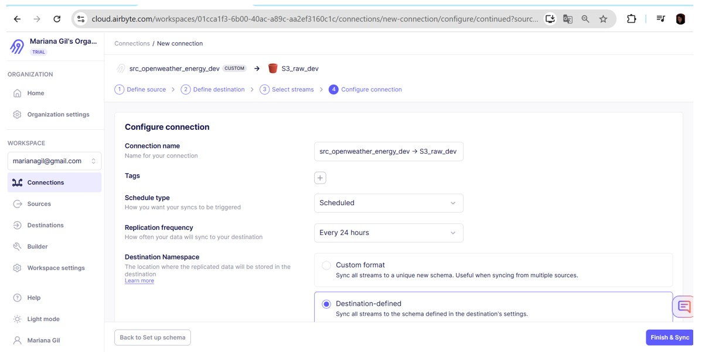
Los datos se almacenan en:

raw/ingesta-tiempo-real/

Los archivos se guardan en formato comprimido:

.jsonl.gz
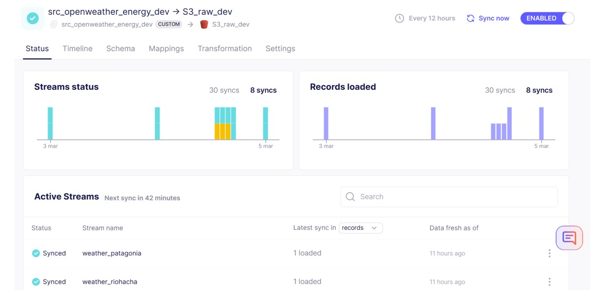
---

# 7. Generación de históricos

Para generar un registro histórico de los datos se desarrolla un **script en Python**.
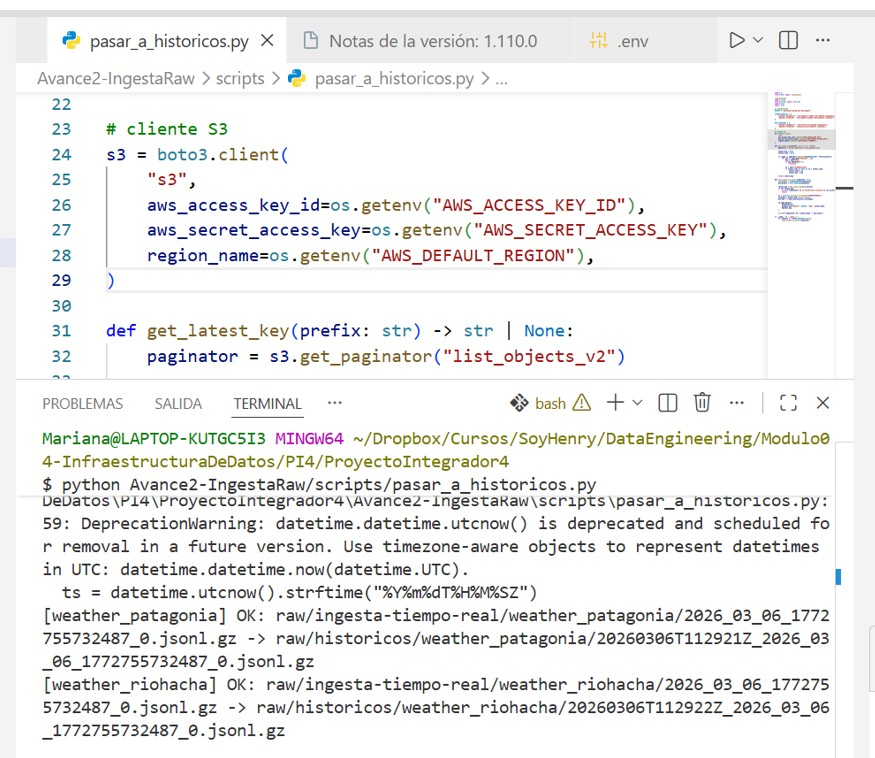
El script realiza las siguientes tareas:

1. Busca en la carpeta:

raw/ingesta-tiempo-real

2. Dentro de cada subcarpeta identifica el archivo más reciente.

3. Copia ese archivo a la carpeta:

raw/historicos

4. Agrega un timestamp al nombre del archivo para preservar el histórico.
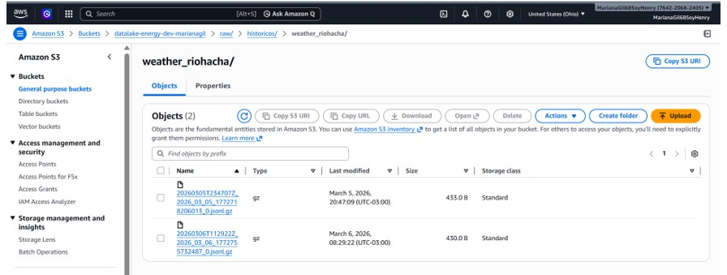
Ejemplo:

raw/historicos/weather_patagonia/
20260305T234035Z_2026_03_05_1772718206013_0.jsonl.gz

De esta forma se mantiene un registro acumulado de todas las mediciones realizadas por el pipeline.

Este mecanismo se implementa incluso cuando Airbyte sobrescribe archivos en el stream, para evitar pérdida de datos ante cambios futuros en la configuración.

---

# Estructura final del Data Lake

datalake-energy-dev-marianagil
│
└── raw
    │
    ├── ingesta-tiempo-real
    │   ├── weather_patagonia
    │   └── weather_riohacha
    │
    └── historicos
        ├── weather_patagonia
        └── weather_riohacha

---

# Tecnologías utilizadas

- Python
- boto3
- Airbyte
- OpenWeather API
- Amazon S3
- AWS IAM

---

# Resultado

Se implementó un pipeline funcional que:

- extrae datos desde una API externa
- los almacena en un Data Lake en S3
- mantiene un historial de mediciones
- organiza la información en la zona RAW

Este pipeline constituye la base para las siguientes etapas del proyecto, donde se procesarán los datos para generar capas **Refined** y **Analytics**.
