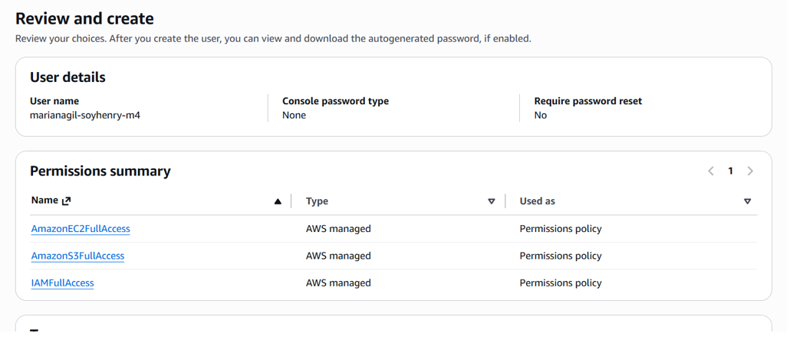
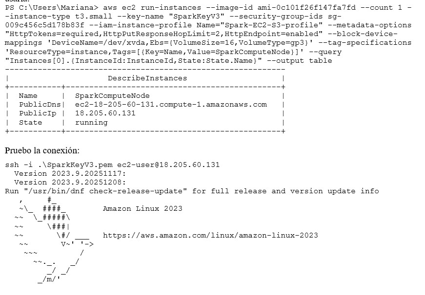
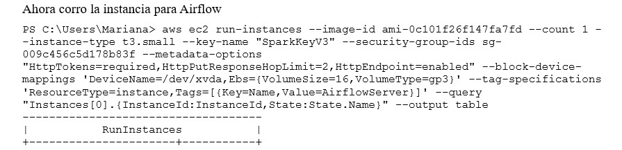
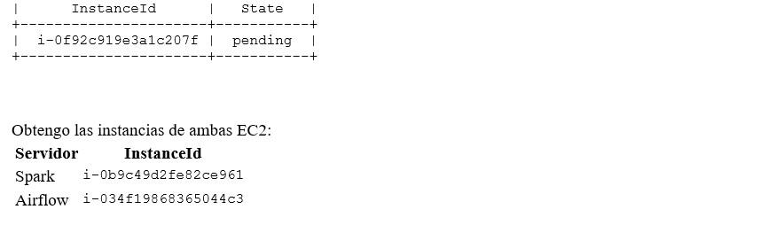
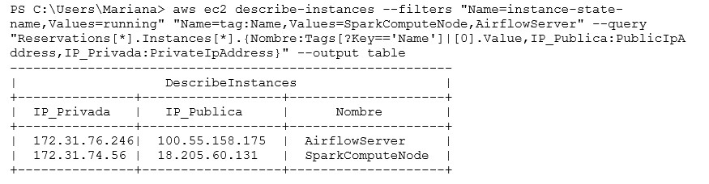
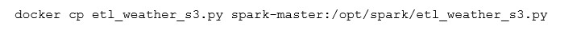
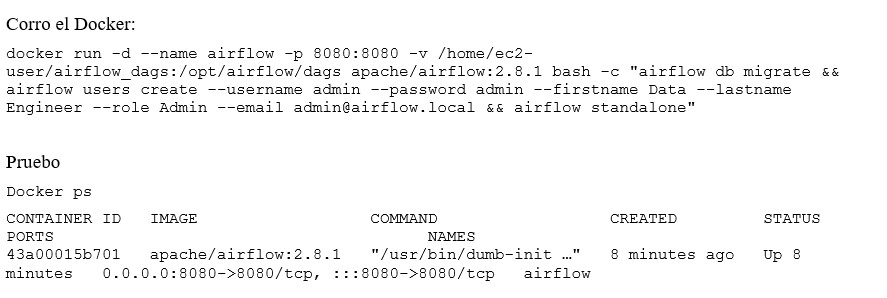
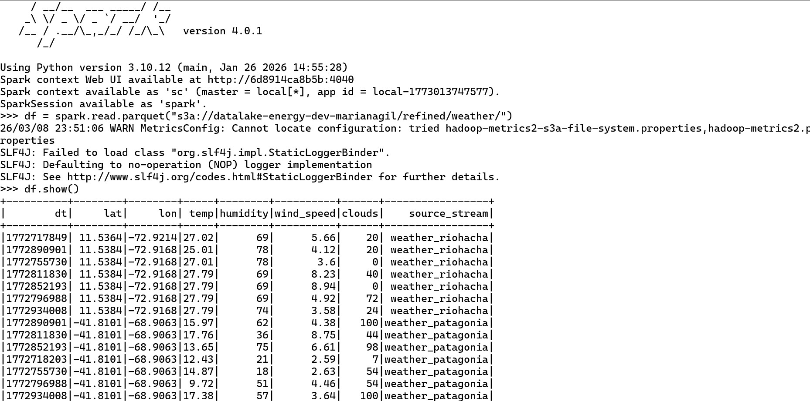
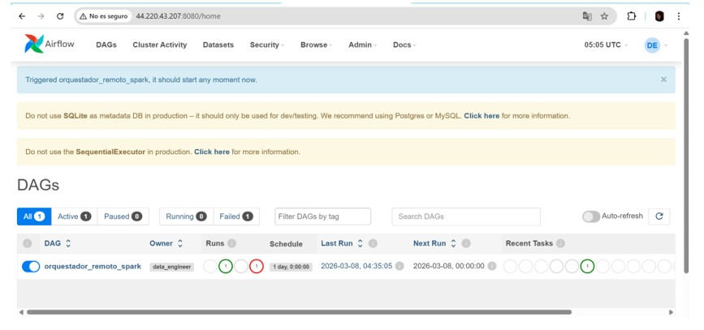

# Proyecto Integrador – Avance 3  
## Procesamiento y Paso a Zona Refined

Este proyecto continúa el pipeline de datos climáticos, tomando los archivos originales de la **zona RAW del Data Lake** y procesándolos utilizando **Apache Spark**. Para coordinar la ejecución, se implementa orquestación remota con **Apache Airflow**.

El objetivo de este avance es unificar las mediciones de las distintas ciudades extraídas, limpiar y estructurar los datos y guardarlos en la **zona Refined** en formato columnar **Parquet** optimizado.

---

# Arquitectura del flujo de datos

El pipeline implementado en este avance sigue el siguiente flujo:

Amazon S3 (raw/historicos)  
↓  
Apache Spark (Procesamiento en EC2)  
↓  
Amazon S3 (refined/weather_unified_parquet)  
↑  
Apache Airflow (Orquestación en EC2)

Los archivos almacenados en múltiples particiones JSON (`.jsonl.gz`) se leen y transforman, para luego consolidarse en un único conjunto de datos limpio para analítica.

---

# 1. Configuración del Entorno, Usuarios y Permisos IAM

Para dotar a los servidores del acceso seguro a los servicios requeridos, se configura IAM en AWS.

1. Se crea un nuevo usuario en IAM con permisos para EC2 y generación de Access Key.
2. Se generan las credenciales y se configura la AWS CLI en PowerShell.
3. Se crea la clave SSH (`SparkKeyV3.pem`) y se ajustan sus permisos en Windows para asegurar la conexión segura a las instancias.

Para evitar el uso de credenciales *hardcodeadas* (claves explícitas en el código de Spark), se crea un **Rol IAM** asociado a un **Perfil de Instancia**:
- Se configura un archivo de políticas de confianza.
- Se le otorgan permisos de acceso completo a S3 (`AmazonS3FullAccess`).
- Este Perfil de Instancia se adjunta al nodo EC2 de Spark al momento de crearlo.

---

# 2. Lanzamiento de los Servidores (Spark y Airflow)

Se despliegan dos servidores independientes en AWS EC2, usando la imagen Amazon Linux 2023. Ambas máquinas se lanzan en instancias `t3.small` con 16 GB de almacenamiento EBS (gp3) para evitar posibles errores de disco durante el procesamiento.

- **Servidor 1: Spark Compute Node**
  - Ejecuta el motor de procesamiento distribuido.
  - Instancia: `t3.small`
  - Perfil IAM asociado para lectura/escritura en S3.

- **Servidor 2: Airflow Orchestrator**
  - Contiene el orquestador encargado de iniciar las tareas.
  - Instancia: `t3.small`

Una vez levantadas, se capturan las direcciones IP Públicas y Privadas necesarias para las conexiones SSH.

---

# 3. Despliegue del Nodo Spark

Se establece una conexión SSH hacia el **Servidor 1** usando la clave PEM y la IP pública. 

En este entorno temporal se realiza la instalación del motor Docker y se genera una red aislada (`spark-net`). 
Posteriormente, se levantan dos contenedores para habilitar el cluster *standalone* de Spark:
- `spark-master` (Expone puerto 8080 de UI y 7077 de conexión)
- `spark-worker` (Con 2 cores y 2g de memoria)

### Generación del Script ETL Python (`etl_weather_s3.py`)

Se programa un script en PySpark para procesar la información. 
El script realiza las siguientes tareas:

1. Levanta la sesión y asigna los provider correctos de credenciales de Instancia (`InstanceProfileCredentialsProvider`)
2. Lee los archivos históricos JSON comprimidos (`.jsonl.gz`) directo desde las rutas S3 para los streams de `weather_patagonia` y `weather_riohacha`.
3. Extrae las variables de interés anidadas dentro de la estructura de OpenWeather (`_airbyte_data.current.*` y `_airbyte_data.*`):
   - `dt` (Timestamp)
   - `lat` (Latitud)
   - `lon` (Longitud)
   - `temp` (Temperatura)
   - `humidity` (Humedad)
4. Agrupa todos los registros usando una unión (Union) y asigna la literal `source_stream` indicando el origen de los datos.
5. Exporta el DataFrame final hacia la carpeta `refined/weather_unified_parquet` sobrescribiendo en formato **Parquet** con compresión Snappy.

El script se transfiere e inyecta al interior de la partición compartida del contenedor `spark-master` usando `docker cp`.

---

# 4. Despliegue del Nodo Airflow

Se establece una conexión SSH hacia el **Servidor 2**.

Al igual que en el nodo de procesamiento, se instala y configura Docker. A continuación, se lanza el contenedor de `apache/airflow` en modo `standalone`, asociándole un volumen local para la configuración de DAGs y definiendo un usuario administrador.

### Creación del Orquestador Remoto (DAG)
Se crea un archivo `spark_remote_etl.py`. Este DAG incluye un operador `SSHOperator` que permite a Airflow conectarse de forma remota al nodo de Spark y ejecutar explícitamente el binario de `spark-submit`. 

En la submit de Spark, se descargan primero dinámicamente los paquetes necesarios para AWS/Hadoop (`hadoop-aws` y `aws-java-sdk`), lo que posibilita a Spark interpretar los prefijos virtuales S3 y guardar la información procesada.

---

# 5. Configuración de Conexión y Ejecución (Airflow UI)

Para permitir que el `SSHOperator` de Airflow ingrese al nodo de Spark, es necesario configurar una Conexión interna dentro de Airflow de tipo "SSH". 

Para inyectar la clave RSA de forma correcta en la interfaz, se procesa el archivo `.pem` original en la terminal de Windows transformando los saltos de línea y formateándolos en un objeto JSON compatible con el campo Extra de las credenciales de Airflow.

Finalmente, se accede a la interfaz gráfica web de Airflow en el puerto 8080 del Servidor 2, y en Admin -> Connections se guarda esta nueva conexión. 

Se procede a activar y realizar un Trigger del DAG `orquestador_remoto_spark`. Durante la ejecución, desde la propia UI de Airflow es posible verificar los logs transmitidos en tiempo real por el proceso remoto de Spark, que arrojará el éxito o error una vez que el Driver finalice y retorne el código de estado.

---

# Resultados y Estructura Actual del Data Lake

Tras la ejecución exitosa del pipeline de agregación vía DAG, las mediciones climáticas unificadas pueden validarse corriendo una instancia de `PySpark` interactivo, comprobando de este modo la creación de la particiones.

La estructura del Data Lake queda lista para el paso de visualización y Analytics:

`datalake-energy-dev-marianagil`  
│  
├── `raw/`  
│   ├── `ingesta-tiempo-real/`  
│   └── `historicos/` (JSON almacenados con Timestamp)  
│  
└── `refined/`  
    └── `weather_unified_parquet/` (DataFrames normalizados en formato Columnar Snappy.Parquet)  

---

# Tecnologías utilizadas

- Apache Spark (PySpark)
- Apache Airflow
- Docker
- Amazon Web Services (EC2, IAM, S3)
- Python
